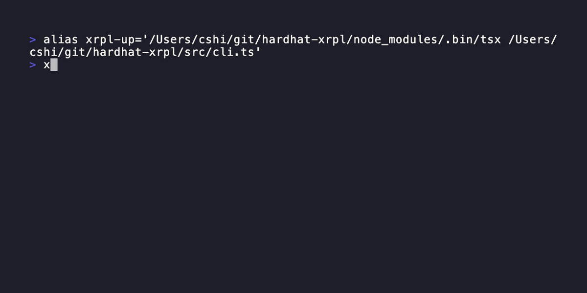

# xrpl-up

CLI for XRPL local development and scripting. Spin up a local sandbox with pre-funded accounts, run scripts, manage snapshots, and interact with remote testnet/devnet endpoints from one tool.



## Prerequisites

- **Node.js** v20 or later
- **Docker** (required for `--local` mode only)

## Installation

**From npm (global):**

```bash
# Latest stable release
npm install -g xrpl-up

# Beta release
npm install -g xrpl-up@beta-experimental
```

**From source (development):**

```bash
git clone https://github.com/ripple/xrpl-up.git
cd xrpl-up
npm install
npm run build
npm link
```

## Claude Code Plugin

xrpl-up includes a [Claude Code](https://claude.ai/code) plugin that lets you interact with the XRP Ledger using natural language.

**Install:**

```bash
claude plugin marketplace add ripple/xrpl-up
claude plugin install xrpl-up@xrpl-up --scope user
```

**Usage:** In a Claude Code session, use `/xrpl-up:xrpl-up` followed by what you want to do:

```
/xrpl-up:xrpl-up start local sandbox
/xrpl-up:xrpl-up show status
/xrpl-up:xrpl-up list pre-funded accounts
/xrpl-up:xrpl-up create an XRP/USD AMM trading pair on local
/xrpl-up:xrpl-up swap 10 XRP for USD using account 2
/xrpl-up:xrpl-up show balance for account 2
/xrpl-up:xrpl-up stop the sandbox
```

Claude translates your request into the correct `xrpl-up` commands, executes them, and explains the result in plain language.

## Quick Start

```bash
# Scaffold a new project (select "local" as default network)
xrpl-up init my-project
cd my-project && npm install

# Start a local sandbox with 10 pre-funded accounts (local is the default)
xrpl-up start

# In another terminal — list accounts with live balances
xrpl-up accounts

# Run a script against the local sandbox
xrpl-up run scripts/example-payment.ts

# Create an XRP/USD AMM pool (100 XRP + 100 USD, 0.5% fee)
xrpl-up amm create --asset XRP --asset2 USD/rIssuer... --amount 100000000 --amount2 100 --trading-fee 500 --node local --seed sEd...

# Mint a transferable NFT
xrpl-up nft mint --taxon 0 --uri https://example.com/meta.json --transferable --seed sn3nxiW7...

# Create an MPT issuance (Multi-Purpose Token)
xrpl-up mptoken issuance create --node local --max-amount 1000000 --asset-scale 6

# Open a payment channel
xrpl-up channel create --to rDestination... --amount 10 --settle-delay 86400 --seed sSrc...
```

---

## Commands

`xrpl-up` has two command sets:

- **Sandbox operation commands**: environment lifecycle and state control (`start`, `stop`, `reset`, `snapshot`, `status`, `accounts`, `logs`, `config`, `run`, `init`, `faucet`, `amendment`).
- **XRPL interaction commands**: transaction submission and account management (`wallet`, `account`, `payment`, `trust`, `offer`, `amm`, `nft`, `mptoken`, `escrow`, `check`, `channel`, `ticket`, `clawback`, `credential`, `did`, `multisig`, `oracle`, `deposit-preauth`, `permissioned-domain`, `vault`).

XRPL interaction commands are intentionally non-exhaustive. For complex or production-grade flows, use `xrpl.js` directly or call `rippled` RPC endpoints.

### Global flag: `--node`

All XRPL interaction commands accept a global `--node` option that sets the network target:

| Value | Connects to |
|-------|-------------|
| `testnet` (default) | XRPL Testnet |
| `devnet` | XRPL Devnet (may include pre-release amendments not yet supported by this tool) |
| `local` | Local sandbox (`ws://localhost:6006`) |
| `wss://...` | Any custom WebSocket URL |

```bash
# Use local sandbox (start first with: xrpl-up start)
xrpl-up account info rMyAddress --node local

# Use testnet (default — no --node needed)
xrpl-up account info rMyAddress

# Use a custom WebSocket URL
xrpl-up account info rMyAddress --node ws://my-node:6006

# Set via environment variable
export XRPL_NODE=local
xrpl-up payment --to rDest --amount 10
```

`--node` only applies to XRPL interaction commands; sandbox lifecycle commands (`start`, `stop`, `reset`, etc.) use `--local` / `--local-network` for the local sandbox and `--network` for remote networks.

### `xrpl-up start`

Starts a sandbox environment and funds accounts. Supports a fully local rippled node (via Docker) or a connection to XRPL Testnet/Devnet.

Two local modes are available:

| Mode | Command | Ledger close | State | Best for |
|------|---------|-------------|-------|----------|
| **Standalone** (default) | `xrpl-up start` | Instant | Ephemeral | CI, quick tests, scripting |
| **Local network** | `xrpl-up start --local-network` | ~4s (consensus) | Persistent | Long dev sessions, snapshots |

**Standalone** is a single rippled node with instant ledger closes. State is wiped on each start. Use this for CI pipelines, quick sanity checks, and any workflow where you don't need state to survive restarts.

**Local network** (`--local-network`) runs a 2-node private consensus network. Ledgers close via real consensus (~4s), state persists across stop/start, and snapshots are supported. Use this when you're building an app over hours or days against a stable environment — set up AMM pools, trust lines, and funded accounts once, snapshot the state, and roll back when you need to.

```bash
# Quick sandbox — fast, ephemeral (CI, scripting, sanity tests)
xrpl-up start

# Persistent local network — real consensus, snapshots, survives restarts
xrpl-up start --local-network

# Connect to Testnet instead
xrpl-up start --network testnet

# Connect to Devnet instead
xrpl-up start --network devnet
```

**Local mode options:**

| Flag | Default | Description |
|------|---------|-------------|
| `--local` | — | Run a local rippled node via Docker |
| `--local-network` | off | Start a 2-node consensus network (persistent state, snapshot support) |
| `--image <image>` | `xrpllabsofficial/xrpld:latest` | rippled Docker image |
| `--ledger-interval <ms>` | `1000` | Auto-advance ledger every N milliseconds (standalone only) |
| `--no-auto-advance` | — | Disable automatic ledger closing |
| `--no-secrets` | — | Suppress seeds and private keys from stdout (auto-enabled with `--detach`) |
| `--debug` | — | Enable rippled debug logging |
| `--detach` | — | Start in background and exit (for CI/CD) |
| `--config <path>` | — | Use a custom `rippled.cfg` instead of the auto-generated one |
| `--exit-on-crash` | — | Exit with code 134 when rippled crashes (SIGABRT); disables container auto-restart |
| `-a, --accounts <n>` | `10` | Number of accounts to pre-fund |

> **Note:** The local sandbox is a clean-room environment — ledger starts at index 1 with only the genesis wallet. It is not a mirror of the public ledger. What matters is that transaction validation rules match the rippled version in use.
>
> **AMM / XLS-30 and MPT / XLS-33:** Both AMM and MPT (Multi-Purpose Token) are enabled by default in the local sandbox. xrpl-up uses the `[amendments]` section in `rippled.cfg` to force-enable the required amendments at genesis creation. No voting or ledger advancement is needed.

> **Hardware:** A typical developer laptop is sufficient (~2 GB RAM, ~500 MB disk for the Docker image). The local sandbox has no internet requirement and only processes transactions you submit locally.

---

### `xrpl-up stop`

Stops the local Docker sandbox stack.

```bash
xrpl-up stop
```

---

### `xrpl-up reset`

Wipes all local sandbox state and starts with a clean slate. Useful after a `--local-network` session or when you want to discard all ledger state and funded accounts.

```bash
# Wipe containers, ledger volume, and accounts — keep snapshots
xrpl-up reset

# Wipe everything including saved snapshots
xrpl-up reset --snapshots
```

What `xrpl-up reset` removes:
- Running Docker containers (`docker compose down`)
- Ledger volumes (`xrpl-up-local-db` and `xrpl-up-local-peer-db` in consensus mode)
- `~/.xrpl-up/local-accounts.json`
- With `--snapshots`: `~/.xrpl-up/snapshots/` and all snapshot files

> Snapshots are kept by default since they are the only way to recover a previous state. Use `--snapshots` only when you want a complete wipe.

---

### `xrpl-up accounts`

Lists funded accounts with their live XRP balances.

```bash
xrpl-up accounts                          # local (default)
xrpl-up accounts --network testnet

# Query any address directly
xrpl-up accounts --address rSomeAddress...
```

---

### `xrpl-up faucet`

Funds a new or existing account via the local sandbox faucet or a public testnet/devnet faucet. Funded accounts are automatically saved to `~/.xrpl-up/{network}-accounts.json` so they appear in `xrpl-up accounts`.

```bash
# Generate and fund a new wallet on the local sandbox (default)
xrpl-up faucet

# Fund an existing wallet by seed on the local sandbox
xrpl-up faucet --seed sn3nxiW7v8KXzPzAqzyHXbSSKNuN9

# Use the public Testnet faucet
xrpl-up faucet --network testnet
```

> Faucet targets supported by this command: `local` (default), `testnet`, `devnet`.

---

### `xrpl-up status`

Shows rippled server info and faucet health.

```bash
xrpl-up status                     # local (default)
xrpl-up status --network testnet
```

Displays rippled version, current ledger index, and faucet availability.

---

### `xrpl-up run <script>`

Runs a TypeScript or JavaScript script with the network URL injected as environment variables. TypeScript is executed directly via `tsx` (no build step needed).

```bash
xrpl-up run scripts/example-payment.ts --network local
xrpl-up run scripts/my-script.js --network testnet
```

**Injected environment variables:**

| Variable | Description |
|----------|-------------|
| `XRPL_NETWORK` | Network key (e.g. `local`, `testnet`) |
| `XRPL_NETWORK_URL` | WebSocket URL (e.g. `ws://localhost:6006`) |
| `XRPL_NETWORK_NAME` | Human-readable name |

**Example script:**

```ts
// scripts/send-payment.ts
import { Client, xrpToDrops, Wallet } from 'xrpl';

async function main() {
  const client = new Client(process.env.XRPL_NETWORK_URL!);
  await client.connect();

  const sender = Wallet.fromSeed('sn3nxiW7v8KXzPzAqzyHXbSSKNuN9'); // from xrpl-up accounts

  await client.submitAndWait(
    {
      TransactionType: 'Payment',
      Account: sender.address,
      Amount: xrpToDrops('10'),
      Destination: 'rDestinationAddress...',
    },
    { wallet: sender }
  );

  console.log('Payment sent!');
  await client.disconnect();
}

main().catch(console.error);
```

---

### `xrpl-up logs`

Streams Docker Compose logs from the running local sandbox.

```bash
xrpl-up logs           # all services
xrpl-up logs rippled   # rippled only (useful with --debug)
xrpl-up logs faucet    # faucet server only
```

---

### `xrpl-up amm`

Manage AMM pools (XLS-30). AMM is enabled by default in the local sandbox — no extra configuration needed.

#### `xrpl-up amm create --asset <XRP|CURRENCY/issuer> --asset2 <XRP|CURRENCY/issuer>`

Creates an AMM liquidity pool. The signing account must already hold both assets.

> **Prerequisite:** Enable `DefaultRipple` on the issuer account before creating the pool, otherwise the transaction will fail:
> ```bash
> xrpl-up account set --set-flag defaultRipple --node local --seed sEdIssuer...
> ```

```bash
# XRP/USD pool — 100 XRP (in drops) + 100 USD, 0.5% fee
xrpl-up amm create \
  --asset XRP \
  --asset2 USD/rIssuerAddress... \
  --amount 100000000 \
  --amount2 100 \
  --trading-fee 500 \
  --node local \
  --seed sEdLP...
# → AMM Account: rAMM...
# → LP Token: 03930D...
```

| Flag | Required | Description |
|------|----------|-------------|
| `--asset <spec>` | Yes | First asset: `XRP` or `CURRENCY/issuer` |
| `--asset2 <spec>` | Yes | Second asset: `XRP` or `CURRENCY/issuer` |
| `--amount <value>` | Yes | Amount of first asset (XRP: drops integer, IOU: decimal) |
| `--amount2 <value>` | Yes | Amount of second asset (XRP: drops integer, IOU: decimal) |
| `--trading-fee <n>` | Yes | Fee in units of 1/100000 (0–1000, where 1000 = 1%) |
| `--seed / --mnemonic / --account` | Yes | Key material for signing |

> **XRP amounts are in drops:** 1 XRP = 1,000,000 drops. Use `--amount 100000000` for 100 XRP.

#### `xrpl-up amm info --asset <XRP|CURRENCY/issuer> --asset2 <XRP|CURRENCY/issuer>`

Shows current pool state: reserves, LP token supply, trading fee, and AMM account.

```bash
# Query by asset pair
xrpl-up amm info --asset XRP --asset2 USD/rIssuerAddress... --node local

# JSON output
xrpl-up amm info --asset XRP --asset2 USD/rIssuerAddress... --node local --json
```

Asset format: `XRP` for native currency, `CURRENCY/rIssuerAddress` for IOUs (e.g. `USD/rHb9CJ...`).

---

### `xrpl-up nft`

NFT lifecycle operations (XLS-20).

#### `xrpl-up nft mint --taxon <n>`

Mints a new NFT. `--taxon` is required.

```bash
# Mint a transferable NFT (taxon 0) with a metadata URI
xrpl-up nft mint --taxon 0 --uri https://example.com/nft-meta.json --transferable --seed sn3nxiW7...

# Mint on testnet with royalty fee (basis points, requires --transferable)
xrpl-up nft mint --taxon 42 --uri https://example.com/meta.json \
  --transferable --transfer-fee 500 --node testnet --seed sn3nxiW7...
```

| Flag | Default | Description |
|------|---------|-------------|
| `--taxon <n>` | **required** | NFToken taxon (UInt32) |
| `--uri <uri>` | — | Metadata URI (hex-encoded automatically) |
| `--transferable` | off | Allow the NFT to be transferred (`tfTransferable`) |
| `--burnable` | off | Allow the issuer to burn it (`tfBurnable`) |
| `--mutable` | off | Allow URI modification via `nft modify` (`tfMutable`) |
| `--transfer-fee <bps>` | `0` | Royalty in basis points (0–50000); requires `--transferable` |

#### `xrpl-up nft burn --nft <hex>`

Permanently destroys an NFT.

```bash
xrpl-up nft burn --nft 000800006B9C0B... --seed sHolderSeed...
```

#### `xrpl-up nft modify --nft <hex>`

Updates the URI of a mutable NFT (created with `--mutable`).

```bash
xrpl-up nft modify --nft 000800006B9C0B... --uri https://example.com/new-meta.json --seed sHolderSeed...
```

#### `xrpl-up nft offer create --nft <hex> --amount <amount>`

Creates a buy or sell offer for an NFT.

```bash
# Create a sell offer for 5 XRP
xrpl-up nft offer create --nft 000800006B9C0B... --amount 5 --sell --seed sn3nxiW7...

# Create a sell offer for 10 USD (IOU)
xrpl-up nft offer create --nft 000800006B9C0B... --amount "10/USD/rHb9CJA..." --sell --seed sn3nxiW7...

# Create a buy offer (requires --owner to identify the NFT holder)
xrpl-up nft offer create --nft 000800006B9C0B... --amount 5 --owner rHolderAddress... --seed sBuyerSeed...
```

#### `xrpl-up nft offer accept --sell-offer <hex> | --buy-offer <hex>`

Accepts a buy or sell offer.

```bash
# Accept a sell offer (buyer runs this)
xrpl-up nft offer accept --sell-offer A1B2C3D4... --seed sBuyerSeed...

# Accept a buy offer (NFT holder runs this)
xrpl-up nft offer accept --buy-offer A1B2C3D4... --seed sHolderSeed...
```

#### `xrpl-up nft offer cancel --offer <hex>`

Cancels one or more open NFT offers.

```bash
xrpl-up nft offer cancel --offer A1B2C3D4... --seed sn3nxiW7...
```

#### `xrpl-up nft offer list <nft-id>`

Shows all open buy and sell offers for an NFT.

```bash
xrpl-up nft offer list 000800006B9C0B...
```

To list NFTs owned by an account, use `xrpl-up account nfts <address>`.

---

### `xrpl-up channel`

Payment channel operations. Payment channels allow fast, off-chain micropayments with on-chain settlement.

#### `xrpl-up channel create --to <address> --amount <xrp> --settle-delay <s>`

Opens a payment channel. All three flags are required.

```bash
# Create a 10 XRP channel (settle-delay is required, in seconds)
xrpl-up channel create --to rDestination... --amount 10 --settle-delay 86400 --seed sSourceSeed...

# Create with a 1-hour settle delay
xrpl-up channel create --to rDestination... --amount 10 --settle-delay 3600 --seed sSourceSeed...
```

| Flag | Default | Description |
|------|---------|-------------|
| `--to <address>` | **required** | Destination address |
| `--amount <xrp>` | **required** | Amount of XRP to lock (decimal) |
| `--settle-delay <s>` | **required** | Seconds source must wait before closing with unclaimed funds |

#### `xrpl-up channel list <address>`

Lists open payment channels for an account.

```bash
xrpl-up channel list rSomeAddress...
```

#### `xrpl-up channel fund --channel <hex> --amount <xrp>`

Adds more XRP to an existing channel.

```bash
xrpl-up channel fund --channel ABC123... --amount 5 --seed sSourceSeed...
```

#### `xrpl-up channel sign --channel <hex> --amount <xrp>`

Signs an off-chain claim authorizing the destination to claim up to `--amount` XRP. No on-chain transaction — prints the signature and public key.

```bash
xrpl-up channel sign --channel ABC123... --amount 3 --seed sSourceSeed...
```

The output includes the `--public-key` value needed for `channel claim`. Pass the signature and public key to the destination out-of-band.

#### `xrpl-up channel verify --channel <hex> --amount <xrp> --signature <hex> --public-key <hex>`

Verifies an off-chain claim signature. Exits with code `1` if invalid.

```bash
xrpl-up channel verify --channel ABC123... --amount 3 --signature <hex-signature> --public-key <public-key>
```

#### `xrpl-up channel claim --channel <hex>`

Submits a `PaymentChannelClaim` on-chain. Optionally redeems an off-chain claim or closes the channel.

```bash
# Close the channel (no claim amount)
xrpl-up channel claim --channel ABC123... --seed sDestSeed... --close

# Redeem an off-chain claim (--balance = total XRP delivered by this claim)
xrpl-up channel claim --channel ABC123... --seed sDestSeed... \
  --amount 3 --balance 3 --signature <hex-sig> --public-key <source-public-key>
```

---

### `xrpl-up mptoken`

Multi-Purpose Token (MPT / XLS-33) operations. MPT is enabled automatically in the local sandbox. Use `--node local` to target the local sandbox, or `--node testnet` for Testnet.

#### `xrpl-up mptoken issuance create`

Creates a new MPT issuance.

```bash
# Local sandbox
xrpl-up mptoken issuance create --node local --seed sIssuerSeed... \
  --max-amount 1000000 --asset-scale 6 --transfer-fee 100 --metadata "My Token"

# Minimal (no supply cap, non-transferable by default)
xrpl-up mptoken issuance create --node local --seed sIssuerSeed...
```

| Flag | Default | Description |
|------|---------|-------------|
| `--max-amount <n>` | unlimited | Maximum token supply |
| `--asset-scale <n>` | `0` | Decimal places, 0–19 |
| `--transfer-fee <n>` | `0` | Fee in hundredths of a percent, 0–50000 |
| `--metadata <string>` | — | Metadata string (hex-encoded on-chain) |
| `--seed / --mnemonic / --account` | — | Key material |

#### `xrpl-up mptoken issuance destroy <issuanceId>`

Destroys an MPT issuance. Outstanding supply must be zero.

```bash
xrpl-up mptoken issuance destroy 00070C44... --node local --seed sIssuerSeed...
```

#### `xrpl-up mptoken authorize <issuanceId>`

Authorizes (or unauthorizes) a holder to hold the token.

```bash
# Issuer side: authorize a holder
xrpl-up mptoken authorize 00070C44... --holder rHolderAddress... \
  --node local --seed sIssuerSeed...

# Holder side: opt in (no --holder flag)
xrpl-up mptoken authorize 00070C44... --node local --seed sHolderSeed...

# Revoke authorization
xrpl-up mptoken authorize 00070C44... --holder rHolderAddress... --unauthorize \
  --node local --seed sIssuerSeed...
```

#### `xrpl-up mptoken issuance set <issuanceId>`

Locks or unlocks an MPT issuance or a specific holder's balance. Requires the issuance to have been created with `--can-lock`.

```bash
xrpl-up mptoken issuance set 00070C44... --lock --node local --seed sIssuerSeed...
xrpl-up mptoken issuance set 00070C44... --lock --holder rAddr... --node local --seed sIssuerSeed...
xrpl-up mptoken issuance set 00070C44... --unlock --node local --seed sIssuerSeed...
```

#### `xrpl-up mptoken issuance get <issuanceId>`

Shows on-ledger details of an MPT issuance: issuer, outstanding supply, flags, and metadata.

```bash
xrpl-up mptoken issuance get 00070C4495F14B0E... --node local
```

#### `xrpl-up mptoken issuance list <address>`

Lists MPT issuances created by an account.

```bash
xrpl-up mptoken issuance list rMyAddress... --node local
```

#### Sending MPT payments

Use the `payment` command with an MPT amount format `<amount>/<issuanceId>`:

```bash
xrpl-up payment --to rDestAddress --amount "500/00070C44..." \
  --node local --seed sHolderSeed...
```

For querying MPT balances held by an account, use `xrpl-up account mptokens`.

---

### `xrpl-up offer`

DEX (decentralized exchange) offer operations. The XRPL DEX is a built-in order book — no smart contracts needed.

#### `xrpl-up offer create <pays> <gets>`

Creates a limit order. `<pays>` is what you put in; `<gets>` is what you want out. When `--seed` is omitted a wallet is auto-funded via faucet.

Asset format: `"5"` = 5 XRP, `"10.USD.rIssuer"` = IOU (same as AMM). Decimal values like `"10.5.USD.rIssuer"` are supported.

```bash
# Offer 10 USD for 5 XRP (local by default, auto-funds wallet)
xrpl-up offer create "10.USD.rHb9..." "5"

# Offer 5 XRP for 10 USD on testnet
xrpl-up offer create "5" "10.USD.rHb9..." -n testnet --seed sn3nxiW7...

# Immediate-or-cancel sell offer
xrpl-up offer create "5" "10.USD.rHb9..." --sell --immediate-or-cancel --seed sn3nxiW7...
```

| Flag | Description |
|------|-------------|
| `--passive` | Do not consume matching offers at equal price |
| `--sell` | Sell exactly `TakerPays` regardless of `TakerGets` minimum |
| `--immediate-or-cancel` | Fill what is possible immediately, cancel the rest |
| `--fill-or-kill` | Fill the full amount or cancel entirely |

#### `xrpl-up offer cancel <sequence>`

Cancels an open offer by its sequence number (printed by `offer create`).

```bash
xrpl-up offer cancel 42 --seed sn3nxiW7...
```

#### `xrpl-up offer list`

Lists all open DEX offers for an account.

```bash
xrpl-up offer list
xrpl-up offer list --account rSomeAddress...
```

---

### `xrpl-up trust`

Trust line operations (renamed from `trustline`). Use `xrpl-up account trust-lines` to query existing trust lines.

#### `xrpl-up trust set --currency <code> --issuer <address> --limit <value>`

Creates or updates a trust line.

```bash
# Set a USD trust line with a 1000 limit (local sandbox)
xrpl-up trust set --currency USD --issuer rHb9CJAWyB4rj91VRWn96DkukG4bwdtyTh \
  --limit 1000 --node local --seed sn3nxiW7...

# With NoRipple flag
xrpl-up trust set --currency USD --issuer rHb9... --limit 1000 \
  --no-ripple --node local --seed sn3nxiW7...

# Freeze a trust line (issuer only)
xrpl-up trust set --currency USD --issuer rHolderAddress... \
  --limit 0 --freeze --node local --seed sIssuerSeed...

# Unfreeze
xrpl-up trust set --currency USD --issuer rHolderAddress... \
  --limit 0 --unfreeze --node local --seed sIssuerSeed...
```

| Flag | Description |
|------|-------------|
| `--currency <code>` | Currency code (3-char ASCII or 40-char hex) |
| `--issuer <address>` | Issuer address |
| `--limit <value>` | Trust line limit (0 removes the trust line) |
| `--no-ripple` | Set NoRipple flag |
| `--clear-no-ripple` | Clear NoRipple flag |
| `--freeze` | Freeze the trust line (issuer only) |
| `--unfreeze` | Unfreeze the trust line |
| `--auth` | Authorize the trust line |

#### Query trust lines

```bash
xrpl-up account trust-lines rMyAddress... --node local
```

To enable `DefaultRipple` (rippling on all new trust lines), use `xrpl-up account set --set-flag defaultRipple`.

---

### `xrpl-up escrow`

Escrow operations. Escrows lock XRP until a time condition or crypto-condition is met.

#### `xrpl-up escrow create --to <address> --amount <xrp>`

Creates an escrow. `--to` and `--amount` are required; at least one of `--finish-after`, `--cancel-after`, or `--condition` is also required.

Time values are ISO 8601 datetimes (e.g. `2026-06-01T00:00:00Z`).

```bash
# Time-locked: can finish after a specific time, auto-cancels after another
xrpl-up escrow create --to rDest... --amount 10 \
  --finish-after 2026-06-01T00:00:00Z --cancel-after 2026-12-01T00:00:00Z --seed sn3nxiW7...

# Crypto-condition escrow
xrpl-up escrow create --to rDest... --amount 10 \
  --condition A0258020... --cancel-after 2026-12-01T00:00:00Z --seed sn3nxiW7...
```

#### `xrpl-up escrow finish --owner <address> --sequence <n>`

Releases escrowed funds to the destination after the `FinishAfter` time. `--owner` and `--sequence` are required. For crypto-condition escrows, also provide `--fulfillment` and `--condition`.

```bash
# Time-based finish
xrpl-up escrow finish --owner rOwner... --sequence 42 --seed sDestSeed...

# Crypto-condition finish
xrpl-up escrow finish --owner rOwner... --sequence 42 --seed sDestSeed... \
  --fulfillment A0228020... --condition A0258020...
```

#### `xrpl-up escrow cancel --owner <address> --sequence <n>`

Cancels an expired escrow (after `CancelAfter` time) and returns XRP to the owner.

```bash
xrpl-up escrow cancel --owner rOwner... --sequence 42 --seed sn3nxiW7...
```

#### `xrpl-up escrow list <address>`

Lists escrows for an account, showing amounts, times, and conditions.

```bash
xrpl-up escrow list rSomeAddress...
```

---

### `xrpl-up check`

Check operations. Checks are a deferred payment mechanism — the sender authorizes a maximum amount that the destination can cash at any time before expiry.

#### `xrpl-up check create --to <address> --send-max <amount>`

Creates a check. `--to` and `--send-max` are required; `--send-max` is the maximum the destination can receive.

```bash
# Create a 5 XRP check (valid until a specific date)
xrpl-up check create --to rDest... --send-max 5 --seed sn3nxiW7... --expiration 2026-12-31T00:00:00Z

# Create an IOU check
xrpl-up check create --to rDest... --send-max "10/USD/rHb9..." --seed sn3nxiW7...
```

#### `xrpl-up check cash --check <id>`

Cashes a check. Provide `--amount` for an exact amount or `--deliver-min` for a flexible minimum.

```bash
# Cash exactly 5 XRP
xrpl-up check cash --check ABC123... --amount 5 --seed sDestSeed...

# Cash flexibly — receive at least 3 XRP
xrpl-up check cash --check ABC123... --deliver-min 3 --seed sDestSeed...
```

#### `xrpl-up check cancel --check <id>`

Cancels a check (sender or destination can cancel; anyone can cancel after expiry).

```bash
xrpl-up check cancel --check ABC123... --seed sn3nxiW7...
```

#### `xrpl-up check list <address>`

Lists outstanding checks for an account.

```bash
xrpl-up check list rSomeAddress...
```

---

### `xrpl-up account set`

Enable or disable account flags (replaces the old `accountset` command).

```bash
xrpl-up account set --set-flag requireDestTag --node local --seed sn3nxiW7...
xrpl-up account set --clear-flag requireDestTag --node local --seed sn3nxiW7...
```

| Flag name | Description |
|-----------|-------------|
| `requireDestTag` | Require a destination tag on all incoming payments |
| `requireAuth` | Require the issuer to authorize all trust lines |
| `disallowXRP` | Signal that this account does not accept direct XRP payments |
| `disableMaster` | Disable the master key (use only after setting a signer list) |
| `defaultRipple` | Enable rippling on all new trust lines (issuers) |
| `depositAuth` | Only accept payments from pre-authorized senders |

For IOU clawback, use `--allow-clawback --confirm` (irreversible, not a `--set-flag`).

> **Note:** Set a signer list before disabling the master key (`disableMaster`). For signer list management, use `xrpl-up multisig`. To query account settings, use `xrpl-up account info`.

---

### Transaction history

The `tx` command has been removed. Use `xrpl-up account transactions`:

```bash
xrpl-up account transactions rMyAddress... --node local
xrpl-up account transactions rMyAddress... --node testnet
```

---

### `xrpl-up deposit-preauth`

Manage DepositPreauth entries (renamed from `depositpreauth`). Required when an account has the `depositAuth` flag set.

```bash
# Enable deposit authorization on your account first
xrpl-up account set --set-flag depositAuth --node local --seed sn3nxiW7...

# Pre-authorize a specific sender
xrpl-up deposit-preauth set --authorize rSender... \
  --node local --seed sn3nxiW7...

# Revoke a pre-authorization
xrpl-up deposit-preauth set --unauthorize rSender... \
  --node local --seed sn3nxiW7...

# List all pre-authorizations
xrpl-up deposit-preauth list rMyAddress... --node local
```

---

### `xrpl-up ticket`

Ticket operations. Tickets reserve sequence numbers, allowing transactions to be submitted out-of-order or in parallel — useful for multi-sig workflows.

#### `xrpl-up ticket create --count <n>`

Reserves 1–250 sequence numbers as tickets. Returns the allocated TicketSequence numbers.

#### `xrpl-up ticket list [account]`

Lists existing tickets (reserved sequence numbers) for an account.

```bash
# Reserve 5 ticket sequences
xrpl-up ticket create --count 5 --seed sn3nxiW7...

# Auto-fund a new wallet and reserve tickets (local only)
xrpl-up ticket create --count 3 --auto-fund

# List existing tickets
xrpl-up ticket list
xrpl-up ticket list rSomeAddress...
```

> **Usage:** To use a ticket in a transaction, set `Sequence = 0` and `TicketSequence = <n>`.

---

### `xrpl-up clawback`

Issuer clawback operations. The issuer account must have clawback enabled before use.

> **Prerequisites:**
> - **IOU clawback:** Enable `asfAllowTrustLineClawback` with `xrpl-up account set --allow-clawback --confirm --node local --seed <issuer-seed>`
> - **MPT clawback:** The issuance must have been created with `xrpl-up mptoken issuance create --can-clawback`

#### `xrpl-up clawback --amount <value/CURRENCY/holder | value/ISSUANCE_ID>`

Reclaims issued tokens from a holder. The signing wallet must be the token issuer.

For IOU tokens, embed the holder address in the amount as `value/CURRENCY/holder-address`. For MPT tokens, use `value/ISSUANCE_ID` and pass `--holder`.

```bash
# Clawback 10 USD from a holder (IOU — holder address goes in the amount)
xrpl-up clawback --amount 10/USD/rHolder... --seed sIssuerSeed...

# Clawback 500 units of an MPT (requires --holder)
xrpl-up clawback --amount 500/00000001AABBCCDD... --holder rHolder... --seed sIssuerSeed...
```

---

### `xrpl-up wallet`

Wallet management — create, import, and manage XRPL key pairs in a local keystore (`~/.xrpl/keystore/` by default).

| Subcommand | Description |
|------------|-------------|
| `new` | Generate a new random wallet |
| `new-mnemonic` | Generate a wallet from a BIP39 mnemonic |
| `import` | Import a wallet by seed or mnemonic |
| `list` | List all wallets in the keystore |
| `address` | Print the address for a wallet |
| `private-key` | Print the private key (requires password) |
| `public-key` | Print the public key |
| `sign` | Sign arbitrary data |
| `verify` | Verify a signature |
| `alias` | Set or clear a human-readable alias for a wallet |
| `fund` | Fund a wallet from the testnet faucet |
| `change-password` | Change keystore encryption password |
| `decrypt-keystore` | Export keystore contents (decrypt to plaintext) |
| `remove` | Remove a wallet from the keystore |

```bash
xrpl-up wallet new
xrpl-up wallet fund --account rMyAddress
xrpl-up wallet list
```

---

### `xrpl-up account`

Account query and management. The `account` command provides both query subcommands and mutation subcommands.

| Subcommand | Description |
|------------|-------------|
| `info` | Account flags, sequence, balance, signer list |
| `balance` | XRP and IOU balances |
| `transactions` | Recent transaction history (replaces `tx list`) |
| `offers` | Open offers on the DEX |
| `trust-lines` | Trust lines (replaces `trustline list`) |
| `channels` | Open payment channels |
| `nfts` | NFTs owned by the account |
| `mptokens` | MPT balances held by the account |
| `set` | Enable/disable account flags (replaces `accountset set/clear`) |
| `set-regular-key` | Set or remove the regular key |
| `delete` | Delete the account |

```bash
xrpl-up account info rMyAddress --node local
xrpl-up account transactions rMyAddress --node local
xrpl-up account trust-lines rMyAddress --node local
xrpl-up account balance rMyAddress --node testnet
```

---

### `xrpl-up payment`

Send a Payment transaction. Alias: `xrpl-up send`.

```bash
# Send XRP
xrpl-up payment --to rDest... --amount 10 --node local --seed sSrc...

# Send IOU
xrpl-up payment --to rDest... --amount "10/USD/rIssuer..." \
  --node local --seed sSrc...

# Send MPT
xrpl-up payment --to rDest... --amount "500/00070C44..." \
  --node local --seed sSrc...
```

| Flag | Description |
|------|-------------|
| `--to <address>` | Destination address or alias |
| `--amount <amount>` | Amount: `10` = XRP, `10/USD/rIssuer` = IOU, `500/<issuanceId>` = MPT |
| `--destination-tag <n>` | Destination tag |
| `--memo <text>` | Memo to attach (repeatable) |
| `--send-max <amount>` | SendMax for cross-currency payments |
| `--deliver-min <amount>` | Minimum delivery (enables partial payments) |
| `--partial` | Set tfPartialPayment flag |
| `--dry-run` | Print signed transaction without submitting |

---

### `xrpl-up multisig`

Multi-signature signer list management (replaces `accountset signer-list`).

```bash
xrpl-up multisig --help
```

---

### `xrpl-up credential`

Manage DID-based credentials on the XRP Ledger.

```bash
xrpl-up credential --help
```

---

### `xrpl-up did`

Manage Decentralized Identifiers (DID) on the XRP Ledger.

```bash
xrpl-up did --help
```

---

### `xrpl-up oracle`

Price oracle management on the XRP Ledger.

```bash
xrpl-up oracle --help
```

---

### `xrpl-up permissioned-domain`

Manage Permissioned Domains on the XRP Ledger (XLS-80d).

```bash
xrpl-up permissioned-domain --help
```

---

### `xrpl-up vault`

Manage vaults on the XRP Ledger.

```bash
xrpl-up vault --help
```

---

### `xrpl-up amendment`

Inspect and manage XRPL amendments in the local sandbox. The local sandbox starts with a set of amendments baked into its genesis config; use `enable` to queue additional amendments (takes effect after `xrpl-up reset && xrpl-up start`).

> **Devnet compatibility:** XRPL Devnet may enable pre-release amendments that are not yet supported by the rippled version bundled with this tool. If you encounter unsupported transaction types or behaviors on devnet, check whether the amendment is available in the local sandbox with `xrpl-up amendment list --local --diff devnet`.

> **Local only for mutations:** `enable` writes to the genesis config and only applies to the local sandbox. `list` and `info` work on any network.

#### `xrpl-up amendment list`

Lists all amendments known to the target node with their enabled/supported status.

```bash
# List amendments on the local sandbox
xrpl-up amendment list --local

# List disabled amendments only
xrpl-up amendment list --local --disabled

# Side-by-side diff: local vs testnet
xrpl-up amendment list --local --diff testnet

# List amendments on testnet
xrpl-up amendment list --network testnet
```

#### `xrpl-up amendment info <nameOrHash>`

Shows full details for a single amendment. Accepts the amendment name or a hash prefix.

```bash
xrpl-up amendment info PermissionedDomains --local
xrpl-up amendment info AMM --network testnet
xrpl-up amendment info A730EB18 --local   # hash prefix lookup
```

#### `xrpl-up amendment enable <nameOrHash>`

Queues an amendment for activation in the local sandbox genesis config. Because the local node runs in standalone mode (no consensus), amendments cannot be activated via validator voting — they must be present in the genesis config from the very first ledger. The command writes the amendment hash to `~/.xrpl-up/genesis-amendments.txt`, regenerates `rippled.cfg`, then prompts you to reset and restart.

```bash
xrpl-up amendment enable PermissionedDomains --local
# ⚠  Activating this amendment requires a full node reset.
#    All ledger data, funded accounts, and snapshots will be wiped.
#  Reset and restart the local node now? [y/N]

# Skip the prompt and reset automatically:
xrpl-up amendment enable PermissionedDomains --local --auto-reset
```

> **Standalone mode only.** `enable` modifies the genesis config and only takes effect after a reset — it requires standalone mode (`xrpl-up start` without `--local-network`). In `--local-network` (consensus) mode, all production amendments are pre-activated in the genesis ledger and cannot be changed — once activated, amendments are permanent. To undo an `enable`, simply run `xrpl-up reset` without re-enabling the amendment.

---

### `xrpl-up init [directory]`

Scaffolds a new project with config, TypeScript setup, and example scripts. Prompts for a default network; choose `local` for local-sandbox-ready scripts out of the box.

> **Prerequisite:** `xrpl-up` must be available on PATH. Install globally via `npm install -g xrpl-up` or from source with `npm link` (see [Installation](#installation)). The generated `package.json` scripts (`npm run start`, `npm run accounts`) call `xrpl-up` from PATH and do not re-install it locally.

```bash
xrpl-up init
xrpl-up init my-project
```

**Generated files:**

```
my-project/
├── xrpl-up.config.js          # Network configuration defaults + custom network support
├── package.json
├── tsconfig.json
├── .gitignore
└── scripts/
    ├── example-payment.ts     # Send XRP + verify sender/receiver balances
    ├── example-token.ts       # Issue a custom IOU token (DefaultRipple + TrustSet + Payment)
    ├── example-dex.ts         # Place a DEX order, list it, cancel it (⚠ needs counterparty to fill)
    ├── example-nft.ts         # Full NFT lifecycle: mint → sell offer → accept → burn
    ├── example-mpt.ts         # Issue a Multi-Purpose Token: create issuance → opt in → transfer
    └── example-amm.ts         # Create an AMM pool and execute a swap (local only)
```

When `local` is selected as the default network, the example scripts use the local faucet (`http://localhost:3001`) instead of `client.fundWallet()`. `example-amm.ts` is only scaffolded for local mode since AMM is enabled by default there. The local `example-dex.ts` controls both sides of the trade so the order fills immediately; the remote variant places the order, lists it, then cancels it with a note that a real counterparty is required for fills.

---

### `xrpl-up snapshot`

Save and restore ledger state checkpoints. Useful for complex test setups (AMM pools, issued currencies, multi-step escrows) where re-running setup from scratch is expensive.

> **Requires `--local-network` mode.** Snapshots tar the named Docker volume (`xrpl-up-local-db`) into a self-contained `.tar.gz` file. Restore recreates the volume from that tarball — the volume does not need to have survived between runs. In standalone mode (default), there is no persistent volume to snapshot.

```bash
# Save the current ledger state
xrpl-up snapshot save before-amm

# List saved snapshots
xrpl-up snapshot list

# Restore to a previous checkpoint (~5–10s: rippled + faucet stop, volume restored, both restart)
xrpl-up snapshot restore before-amm
```

Each snapshot saves both the ledger volume **and** a copy of the account store (`local-accounts.json`), so `xrpl-up accounts` reflects the accounts that existed at snapshot time. The account store sidecar is copied as-is — it is not validated against the ledger. The `snapshot list` output shows `+accounts` for any snapshot that includes the account sidecar.

**Typical workflow:**

```bash
xrpl-up start --local-network --detach

# Run expensive setup (fund accounts, create AMM pool, set trust lines...)
xrpl-up faucet --network local
# Wait for funded accounts to appear on the validated ledger (~4s consensus close).
# Snapshot save stops services before archiving — unvalidated transactions may be lost.
xrpl-up accounts --local                        # confirm accounts are on-ledger
xrpl-up snapshot save after-setup

# Run tests, mutate state...

# Roll back to known-good state and run again
xrpl-up snapshot restore after-setup
xrpl-up accounts --local    # shows accounts as of snapshot time
```

**Fresh start from a snapshot after reset:**

```bash
xrpl-up reset                                    # wipe everything
xrpl-up start --local-network --detach          # start sandbox (creates new volume)
xrpl-up snapshot restore after-setup             # restore saved state
xrpl-up accounts --local                         # snapshot accounts restored
```

Snapshots are stored at `~/.xrpl-up/snapshots/` and are portable — copy them to any machine and restore. Each snapshot produces three files:
- `<name>.tar.gz` — compressed node DB volume (typically 5–100 MB)
- `<name>-accounts.json` — account store at snapshot time
- `<name>-meta.json` — snapshot metadata (format version)

---

### `xrpl-up config`

Manage and validate rippled configuration.

#### `xrpl-up config export`

Prints the auto-generated `rippled.cfg` to stdout, or writes it to a file. Use this as a starting point for a custom config.

```bash
# Print to stdout
xrpl-up config export

# Save to file
xrpl-up config export --output my-rippled.cfg

# Export with debug log level
xrpl-up config export --debug --output my-rippled.cfg
```

#### `xrpl-up config validate <file>`

Validates a `rippled.cfg` for compatibility with xrpl-up before you use it. Checks for blocking errors, warnings, and prints recommendations.

```bash
xrpl-up config validate my-rippled.cfg
```

**What is checked:**

| Severity | Check |
|----------|-------|
| Error | WebSocket port must be `6006` (hardcoded by xrpl-up) |
| Error | WebSocket `ip` must be `0.0.0.0` (faucet container access) |
| Error | WebSocket `admin` must include `0.0.0.0` (admin commands) |
| Error | `[ssl_verify]` must be `0` |
| Error | `[node_db]` and `[database_path]` must be present |
| Warning | `node_size = large/huge` risks OOM on developer laptops |
| Warning | `send_queue_limit < 100` may throttle heavy test suites |
| Recommendation | Add `send_queue_limit = 500` for AMM testing |

Exit code `1` if any errors are found, `0` otherwise.

**Custom config workflow:**

```bash
# 1. Export the default as a starting point
xrpl-up config export --output my-rippled.cfg

# 2. Edit — e.g. change node_size, send_queue_limit, log level
$EDITOR my-rippled.cfg

# 3. Validate before starting
xrpl-up config validate my-rippled.cfg

# 4. Start with the custom config
xrpl-up start --local --config my-rippled.cfg
```

Validation also runs automatically when `--config` is passed to `xrpl-up start --local` — the sandbox will not start if there are blocking errors.

---

## CI/CD

Docker is available on all GitHub-hosted runners (`ubuntu-latest`, `macos-latest`).

Standalone mode (the default) is recommended for CI — it starts in seconds, has instant ledger closes, and needs no volume management.

```yaml
# .github/workflows/test.yml
steps:
  - run: xrpl-up start --local --detach
  - run: npm test
  - run: xrpl-up stop
    if: always()
```

> **First run:** `xrpl-up start` automatically pulls the rippled Docker image (~1 GB) on first run and shows download progress. Subsequent runs reuse the cached image.

---

## Configuration

`xrpl-up.config.js` in your project root defines named networks used by `run`, `accounts`, `status`, and remote `start`/`faucet` flows:

```js
module.exports = {
  networks: {
    local: {
      url: 'ws://localhost:6006',
      name: 'Local rippled (Docker)',
    },
    testnet: {
      url: 'wss://s.altnet.rippletest.net:51233',
      name: 'XRPL Testnet',
    },
    devnet: {
      url: 'wss://s.devnet.rippletest.net:51233',
      name: 'XRPL Devnet',
    },
  },
  defaultNetwork: 'local',
};
```

Add any custom WebSocket endpoint as a named network and use it with `--network <name>`.

---

## Supported Networks

| Key | Endpoint | Faucet |
|-----|----------|--------|
| `local` | `ws://localhost:6006` | Yes (genesis wallet, no limits) |
| `testnet` | `wss://s.altnet.rippletest.net:51233` | Yes (rate limited) |
| `devnet` | `wss://s.devnet.rippletest.net:51233` | Yes (rate limited) |

> **Local vs Testnet:** The local sandbox is designed to cover most development workflows without needing testnet. Local mode has no transaction throttling, no faucet rate limits, and full reset control. Standalone mode (default) has instant ledger closes; `--local-network` has ~4s consensus closes but adds persistence and snapshot support. Use testnet for final validation against real network state.

---

## Data Storage

Account seeds, generated configs, and snapshots are stored at:

```
~/.xrpl-up/
  local-accounts.json         # funded account seeds (local mode)
  testnet-accounts.json       # funded account seeds (testnet)
  devnet-accounts.json        # funded account seeds (devnet)
  docker-compose.yml          # generated on each start
  rippled.cfg                 # generated on each start (or custom via --config)
  snapshots/
    before-amm.tar.gz         # node DB volume snapshot (--local-network mode)
    before-amm-accounts.json  # account store at snapshot time
    before-amm-meta.json      # snapshot metadata
    after-setup.tar.gz
    after-setup-accounts.json
    after-setup-meta.json
```

`xrpl-up start` always recreates accounts fresh unless `--local-network` is used. `xrpl-up faucet` appends to the account store regardless of mode. `xrpl-up reset` clears the account store and Docker volume in one command.

---

## License

MIT
